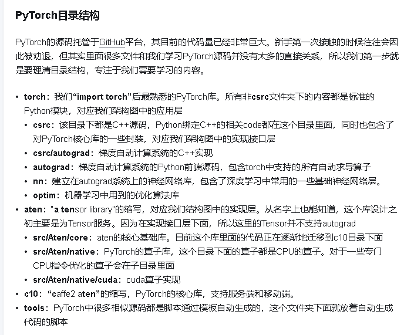
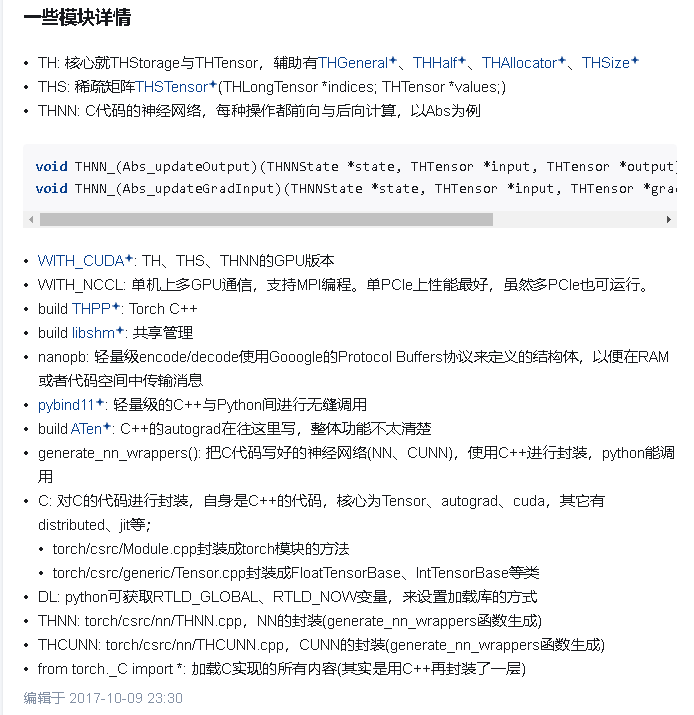

# torch

pytorch 是一个深度学习框架（前端接口是python写的，后端核心由cpp实现）， 而其核心功能 （如张量操作，神经网络模块等）是由 torch 提供

特点：类似于Numpy 但是支持GPU加速

> tips: pytorch 的底层主要是用 C++ 和 CUDA 写的，然后通过 Python 绑定暴露给用户。

Pytorch 一共分成四层（[摘自知乎](https://www.zhihu.com/question/58253344)）

- 应用层（Python）：这应该是大家最熟悉的层，主要涉及到张量，Autograd以及神经网络。该层所有的源码都是由Python编写，这也符合前面所说的PyTorch设计思想-——将C++框架集成到Python里

- 实现接口层（C++）：该层的主要功能我认为有两个：
  
  - **Python 扩展**。通过Python提供的C API将Python应用层与C++实现层绑定起来，使用户在享受Python语言提供的便捷优势时也可以同时享受到C++语言提供的性能优势
  
  - **Autograd系统实现**。 PyTorch并没有在实现层中实现Autograd系统。在此层中PyTorch定义了动态有向图的基本组件Node和Edge，以及在此基础上封装了Function类和Engine类来实现Autograd

- **实现层（C++）**。该层是PyTorch的核心层，定义了PyTorch运行过程中的核心库, 包括**Tensor的具体实现**，**算子实现**（前向与后向运算）以及**动态调度系统**（Tensor的布局，硬件设备，数据类型）。Storage类主要是针对不同硬件数据存储的一种抽象。

- **硬件接口层**。该层主要是硬件厂商基于自家硬件推出的运算接口。

https://www.zhihu.com/question/58253344 如何有效的阅读 PyTorch 源码
