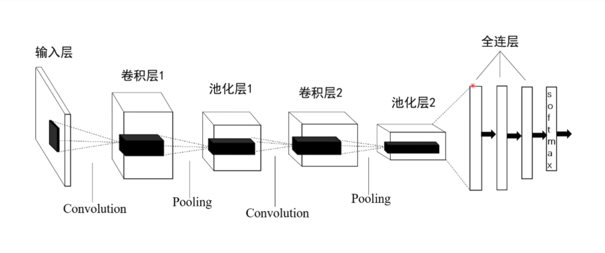
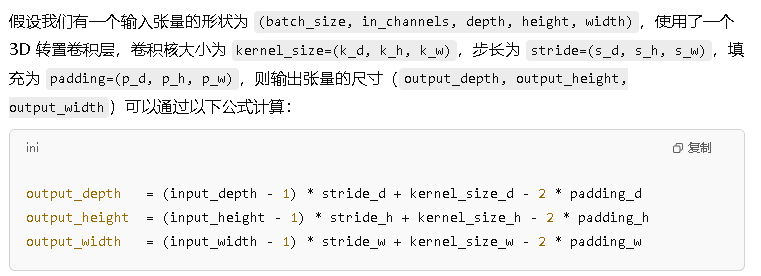
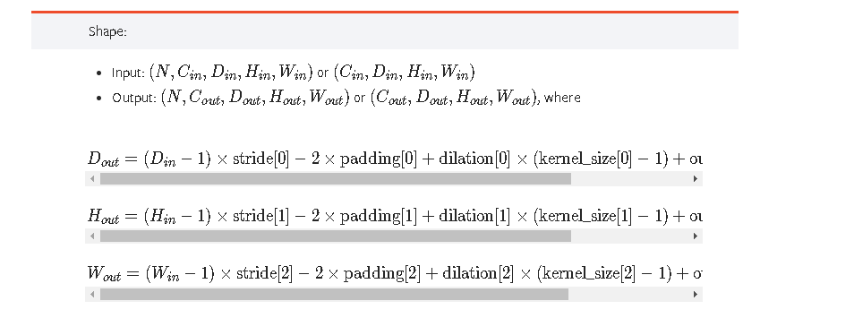
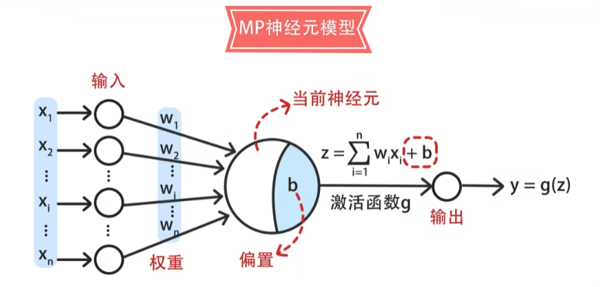

`nn.ConvTranspose3d`

### 3D 转置卷积的常见参数：

- **输入通道数（in_channels）**：输入数据的通道数。
- **输出通道数（out_channels）**：卷积层输出特征图的通道数。
- **卷积核大小（kernel_size）**：卷积核在每个维度上的大小。
- **步长（stride）**：决定卷积核在输入数据上滑动的步幅，通常也用于控制输出的尺寸。
- **填充（padding）**：控制输入数据周围的零填充量，用于控制输出的尺寸。
- **输出填充（output_padding）**：在输出数据中补充的填充量，用于调整输出尺寸。

3D 转置卷积层（也叫做反卷积层）。其作用是通过卷积操作“反向”地扩大（上采样）输入的张量尺寸。

假设输入是一个彩色图像，其尺寸为 `32 x 32`（高度 x 宽度）且具有 3 个通道（RGB），可以表示为形状 `(3, 32, 32)` 的张量。经过卷积操作后，可能会输出多个通道的特征图，例如 16 个通道，这时输出张量的形状为 `(16, 32, 32)`，其中 16 表示输出的通道数（即 16 个不同的特征图）

前置知识：

卷积神经网络

卷积层的主要参数：

- 卷积核（Filter or Kernel）：卷积核是一个小矩阵，它定义了局部区域与输入数据的关系。

- 步长（stride）：步长为 1 时，卷积核每次移动一个像素；步长为2时，卷积核每次移动两个像素。步长的大小，影响输出特征图的空间尺寸。

- 填充（Padding）：填充是输入数据的边界周围添加零值的过程，用来控制输出特征图的尺寸。

**3D 转置卷积层**（3D Transposed Convolution Layer）是一种卷积神经网络中的层，它与常规的卷积层类似，但有一个不同的目标：**将输入的特征图进行上采样**，即增加特征图的空间尺寸。

通常，卷积层是将输入数据压缩或降维，通过提取局部特征来生成较小的输出。而**转置卷积层**（也叫做反卷积层或上采样卷积层）则做的是相反的操作，它通过扩展输入数据的尺寸来生成更大的输出。

它的工作原理可以看作是**扩展**输入数据的尺寸。可以通过“填充”的方式将输入数据的尺寸放大，并且学习到如何生成更加丰富的特征图。

如何将张量的尺寸放大：

- 插值 （Zero Padding / 空洞插值）：首先，转置卷积通过将输入张量的元素之间插入零来增加张量的空间尺寸。这是一种非常基本的上采样方法，通过在原始数据的每个元素之间插入空值，来扩大张量的空间尺寸。

- 卷积核操作（Filtering / 卷积核应用） ：

- 步长与填充的作用：
  
  
  
  

前置：

MP 神经元模型

---

# `nn.ConvTranspose3d` 3D 转置卷积算法

## 功能：

​在由多张输入平面组成的输入图像上应用三维转置卷积操作。​转置卷积操作对每个输入值与可学习的卷积核进行逐元素相乘，然后将所有输入特征平面的输出相加。对三维输入数据进行上采样，增加空间维度（深度、高度和宽度）。

## 输入参数：

- **输入通道数（in_channels）**：输入数据的通道数。
- **输出通道数（out_channels）**：输出数据的通道数。
- **卷积核大小（kernel_size）**：卷积核在每个维度上的大小(核的深度，核的高度，核的宽度)。
- **步长（stride）**：决定卷积核在输入数据上滑动的步幅，通常也用于控制输出的尺寸。
- **填充（padding）**：控制输入数据周围的零填充量（`dilation * (kernel_size - 1) - padding` 点数两侧的隐式零填充量），用于控制输出的尺寸。
- **输出填充（output_padding）**：在输出数据中补充的填充量，用于调整输出尺寸。
- **分组（groups）** ： 从输入通道到输出通道的阻塞连接数，默认值为1。控制输入输出的连接。in_channels 和 out_channels 都必须能被 groups 整除
  - groups = 1 所有输入都卷积到所有输出
  - groups = 2 该操作等效于并排有两个卷积层，每个卷积层看到一般的输入通道并产生一半的输出通道，并且随后将两者连接起来
  - groups = in_channels 每个输入通道都与自己的一组过滤器（大小为 out_channels/in_channels）进行卷积。
- **偏差（bias）** ：如果 `true` ,则向输出添加可学习的偏差，默认值为 True
- **扩张（dialation）** ：控制内核元素之间的间距，默认值为 1

参数 `kernel_size` 、 `stride` 、 `padding` 、 `output_padding` 可以是：

（1）单个int情况下：深度，高度，宽度的尺寸使用相同的值

（2）三个整数的tuple情况下：第一个 `int` 用于深度维度，第二个 `int` 用于高度维度，第三个 `int` 用于宽度维度

## 输出参数：

- 批次大小（N）：由输入数据决定,样本数量

- 输出通道数（C_out）: 通过 out_channels 参数设置

- 输出深度（D_out）

- 输出高度（H_out)

- 输出宽度（W_out）

## 工作量：

3个月

## 方法逻辑：

D_out​=(D_in​−1)×stride[0]−2×padding[0]+dilation[0]×(kernel_size[0]−1)+output_padding[0]+1

H_out​=(H_in​−1)×stride[1]−2×padding[1]+dilation[1]×(kernel_size[1]−1)+output_padding[1]+1

W_out​=(W_in​−1)×stride[2]−2×padding[2]+dilation[2]×(kernel_size[2]−1)+output_padding[2]+1
