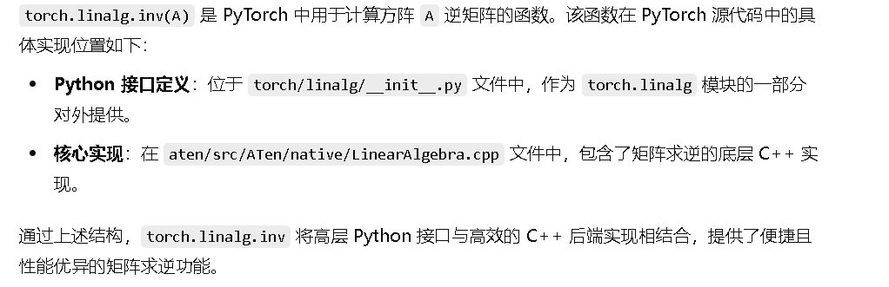

# torch.linalg.inv

如果一个矩阵存在逆矩阵，则计算这个矩阵的逆矩阵并返回

否则抛出 RuntimeError 的异常

> 对于线性代数操作，可能是在 ATen库中实现的，ATen 是 Pytorch 的核心张量库
> 
> ATen中有原生函数（native functions）和由其他后端（如CUDA）实现的函数。矩阵求逆可能涉及到LAPACK库的调用，比如GETRF（LU分解）和GETRI（求逆），这些在CPU上通常由LAPACK处理，而在CUDA上则可能使用cuSOLVER库中的对应函数。
> 
> 然后，用户可能想知道在PyTorch的GitHub仓库中，这些代码具体位于哪些文件。比如，CPU的实现可能在`aten/src/ATen/native/cpu`目录下，而CUDA的实 现可能在`aten/src/ATen/native/cuda`。不过，也有可能这些代码被组织在更通用的线性代数模块中，比如`aten/src/ATen/native/LinearAlgebra.cpp`或对应的CUDA文件。
> 
> 此外，PyTorch的Python API如`torch.linalg.inv`会调用底层的C++函数。因此，需要检查Python端的绑定代码，可能在`torch/linalg/__init__.py`中定义，然后通过C++扩展模块调用底层实现。

​对于正定矩阵，PyTorch 可能会使用 Cholesky 分解来计算其逆，因为 Cholesky 分解在数值上更稳定且计算效率更高。​然而，PyTorch 的 `torch.linalg.inv` 函数并不会仅限于使用 Cholesky 分解，而是根据矩阵的特性和计算环境选择最合适的算法。 

---

# torch.linalg.inv

## 功能：

如果一个矩阵存在逆矩阵，计算逆矩阵。如果矩阵不可逆，则抛出 RuntimeError 异常

支持 float，double， cfloat 和 cdouble 数据类型的输入。还支持矩阵批次，如果 A 是一批矩阵，则输出对应批次的逆矩阵

## 输入参数：

A(Tensor) : （* ，n ，n） 的张量，* 是由可逆矩阵组成的零个或者多个批量的维度

## 输出参数：

out(Tensor) ：输出张量。

## 工作量：

4个月

## 方法逻辑：

若输入矩阵是一个n * n 的对称正定矩阵，可以使用递归 Cholesky 分解算法来计算其逆矩阵。通过Cholesky 分解，得到下三角矩阵 L , 使得 A = L * L^T 。 把AX看成  L * (L^T * L) = L * Y， 求 L * Y = I，得到 Y，求 L ^ T * X = Y, 得到 X，X 即为 A 的逆矩阵 。在昇腾上实现 Cholesky 分解算法需要考虑到昇腾芯片的特性。

若输入矩阵不是n * n 的对称正定矩阵，则可以使用 LU 分解算其逆矩阵。首先进行行列选主元 LU 分解：根据公式 PA = LU , 将源矩阵A 分解为单位下三角矩阵 L，上三角矩阵U 和 置换矩阵P；接着进行三角矩阵求逆：对L矩阵求逆得到其逆矩阵 L ^ -1 将 U 矩阵的转置矩阵求逆后再转置得到 U ^ -1 ; 最后记性矩阵相乘：将矩阵 U ^ -1  和矩阵 L^ -1 相乘，并根据矩阵P将矩阵乘法结果进行列变换得到源矩阵 A ^ -1。
