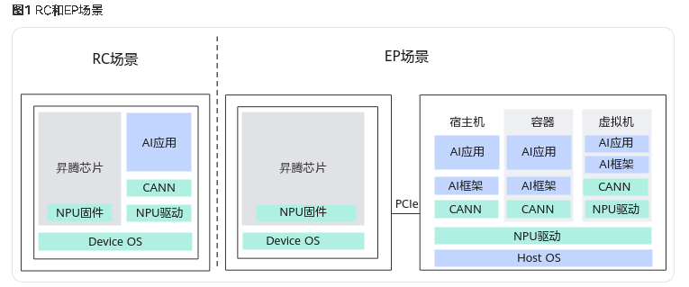

昇腾产品以昇腾AI处理器的PCle（Peripheral Component Interconnect Express）的工作模式进行区分，分为RC（Root Complex）模式和EP（Endpoint）模式，如果PCle工作在主模式，可以扩展外设，则称为RC模式；如果PCle工作在从模式，则称为EP模式。

Atlas 200 DK 开发者套件的  PCIe工作模式 是RC模式， 产品的 CPU 直接运行用户指定的 AI 业务软件， 网络摄像头， 、I2C传感器、SPI显示器等其他外挂设备作为从设备接入产品。

在异构计算架构中， 昇腾AI 处理器与服务器的CPU 通过 PCIe 总线连接协同工作， 我们一般分别称为Device侧 和 Host 侧

Host：CPU所在位置称为主机端， 是指 与昇腾 AI 处理器所在硬件设备（如 Atlas 3001 推理卡） 相连接的X86 服务器或者 ARM 服务器， 利用昇腾AI处理器提供的NN （Neural-Network） 计算能力完成业务

Device ： 是指安装了昇腾 AI 处理器的硬件设备，利用 PCIe 接口与服务器连接，为服务器提供NN计算能力
