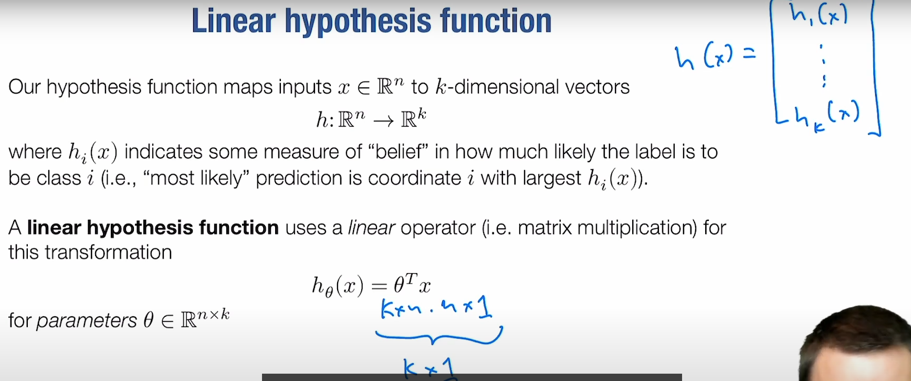
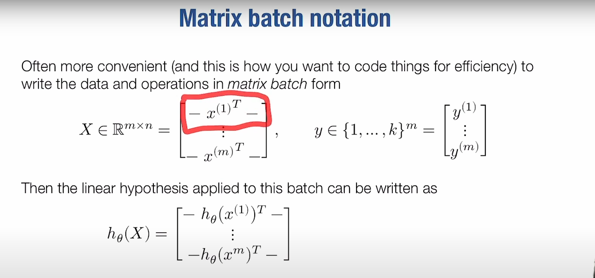

# ML Refresher / Softmax Regression

## Three ingredients of a machine learning algorithm

所有的机器学习算法都包含三个部分：

- the hypothesis class

- the loss function

- an optimization method

m 是实例个数，n 是输入参数个数
