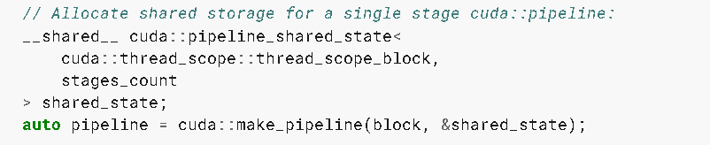
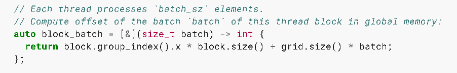
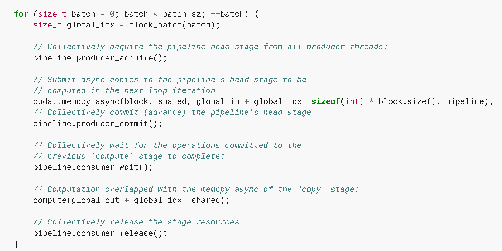
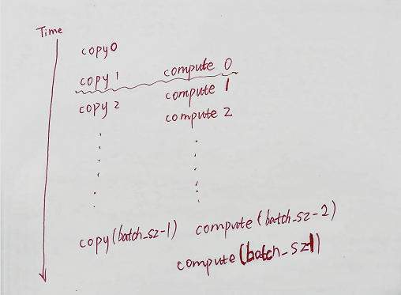

## Asynchronous Data Copies

### 7.27.1 API

异步：操作不需要等待前一个操作完成即可开始

memcpy_async

cooperative_groups::memcpy_async

`memcpy_async` API 主要用于在设备端内核中执行异步的数据传输操作，特别是从全局内存到共享内存的传输。它允许在内核执行期间重叠计算和数据传输，从而提高性能。

扩展：通过将cudaMemcpyAsync 与 CUDA 流结合使用，可以实现主机到设备的数据传输与内核执行的重叠。

> 协作组（cooperative groups 是 cuda9 引入的一种编程模型，用于在 GPU 上实现更高效的线程协作和同步），使用 `cooperative_groups::thread_block::sync()` 可以在协作组内同步所有线程，确保所有线程都执行到这一点后再继续执行后续的操作。

### 7.27.2 复制和计算模式

without memcpy_async : 需要使用中间寄存器

with memcpy_async : 不需要使用中间寄存器

### 7.27.3. Without `memcpy_async`

> shared[local_idx] = global[global_idx]
> 
> 全局至共享内存副本将从全局存储器扩展到寄存器，然后将其从寄存器写入到共享内存。

- 确保在计算阶段开始之前完成对所有共享内存的写入已经完成

- 为了防止所有线程完成计算之前覆盖共享内存，要在计算阶段之后再次同步

这种方式在完成数据拷贝期间，其他操作都不能进行，这样会导致性能下降。

### 7.23.4 With `memcpy_async`

cooperative_groups::memcpy_async(group, shared, global_in + batch_idx, sizeof(int) * block.size());

在拷贝数据完成之前，修改global data 或者 reading or writing the shared data 会造成数据竞争问题

memcpy_async 会通过硬件加速，避免通过中间寄存器传输数据

在执行 memcpy_async 异步拷贝操作时，拷贝过程跟前序的指令是异步执行的，不会阻塞当前线程的执行。为了确保数据一致性和避免数据竞争，需要在拷贝完成之后 cooperative_groups::wait 进行同步

在使用异步数据拷贝的情况下，数据拷贝操作与前序操作是同时进行的，而与后续操作之间的执行顺序取决于如何管理流和同步机制。比如数据拷贝操作与前序操作可以在同一个流中执行，也可以在不同的流中并发执行。

### 7.27.5. Asynchronous Data Copies using `cuda::barrier`

通过屏障同步来管理异步数据传输。

```cpp
__shared__ cuda::barrier<cuda::thread_scope::thread_scope_block> barrier;
if (block.thread_rank() == 0) {
    init(&barrier, block.size()); // Friend function initializes barrier
}
block.sync();
```

声明一个块级别的屏障同步对象barrier， 并在线程块的第一个线程中初始它。然后，调用 block.sync() 确保所有线程在继续执行之前都已经到达此点。

### 7.27.6. Performance Guidance for `memcpy_async`

> 流水线机制被同一warp中的所有线程所共享。这种共享会导致 memcpy_async 被纠缠在warp中，这在某种情况下会影响性能。
> 
> 

在具备计算能力8.0的设备上，[cp.async family of instructions](https://docs.nvidia.com/cuda/parallel-thread-execution/index.html#data-movement-and-conversion-instructions-cp-async) 允许以异步方式将数据从全局内存复制到共享内存。这些指令支持一次拷贝4、8和16个字节。如果提供给`memcpy_async`的大小是 4、8 或 16 字节的倍数，并且传递给`memcpy_async`的两个指针都对齐到4、8或16对齐边界，那么`memcpy_async`就可以完全使用异步内存操作来实现。

为了在使用`memcpy_async` API 时获得最佳性能，共享内存和全局内存的对齐方式都必须是128字节。可以用以下方法实现内存对齐。

- 使用cudaMalloc 分配内存： 使用cudaMalloc分配全局内存的时候，返回的指针通常已经满足128字节对齐要求。

- 使用 `__align__`  关键字， 在定义共享内存和全局内存的时候，可以使用这个关键字来指定对齐方式：```__align__(128) int sharedMemory[SIZE];```

## 7.28. Asynchronous Data Copies using `cuda::pipeline`

流和流水线：

流：主要用于在主机和设备之间，设备内部的不同操作之间实现并发。

流水线：用于在设备内部的不同阶段之间实现并发，通常涉及多个线程块的协作。（将多个操作阶段串联起来，每个阶段由不同的线程块处理，从而实现操作的流水线化。这使得每个线程块可以在处理自己的数据的同时，等待前一个阶段的数据准备好，从而提高资源的利用率，程序的吞吐量）

- `producer_acquire` ： 获取流水线内部队列中一个可用阶段，使当前线程等待，知道流水线的生产者阶段可用。

- `producer_commit` :  提交在当前已获取的流水线阶段上，producer_acquire 调用之后发出的异步操作。提交生产者阶段的操作，表示数据已经准备好给消费者使用。

- `consumer_wait` : 等待流水线中最旧阶段的所有异步操作完成，使当前线程等待，知道流水线的消费者阶段完成前一个阶段的操作。

- `consumer_release` ： 将流水线中最旧的阶段释放回流水线对象来重复使用。释放的阶段随后可以被生产者重新获取。释放消费者阶段的资源，表示当前阶段的操作已经完成。循环处理下一个批次。

### 7.28.1 Single-Stage Asynchronous Data Copies using `cuda::pipeline`

`cuda::pipeline_shared_state<scope, count> ` 封装了允许管道处理多达 count 个并发阶段的有限资源。如果所有资源都在使用中，则 `pipeline.producer_acquire()` 会阻塞生产者线程。



在共享内存中分配了一个`cuda::pipeline_shared_state` 类型的变量 `shared_state` ， 用于存储流水线的状态信息。`cuda::pipeline_shared_state` 是一个模板类，接受两个参数：

- 线程作用域： cuda::thread_scope ::thread_scope_block 表示流水线的作用域是线程块级别，即同一个线程块内的所有线程共享该流水线

- 阶段数量：`stages_count` 表示流水线的阶段数量，即流水线中包含的操作阶段数。



每个线程处理 `batch_sz` 个元素

这段代码的作用是为每个线程块计算其在全局内存中处理的数据的起始位置。

`block.group_index().x` 获取当前线程块在网格中的 x 维索引

`block.size()` 获取线程块中的线程数

`grid.size()` 获取网格中的线程块总数。



代码实例中的compute ，可以与数据拷贝阶段重叠进行执行

### 7.28.2. Multi-Stage Asynchronous Data Copies using `cuda::pipeline`

上面的单阶段，由于只有一个阶段，内存拷贝和计算操作是串行执行的，即每次循环迭代中，线程块先执行内存拷贝操作，然后等待拷贝操作完成后再继续执行计算操作。这意味着内存拷贝和计算操作之间没有重叠，无法充分利用流水线的并行性。

两阶段流水线实现数据传输与计算的重叠：

- 初始化流水线共享状态

- 通过为第一批次调度 memcpy_async 来启动流水线

- 循环所有批次：它为下一个批次安排 memcpy_async ，在完成上一个批次的 memcpy_async 时阻塞所有线程，然后将上一个批次的计算与下一个批次的内存的异步拷贝重叠

- 最后，它通过对最后一个批次执行计算来排空管道




可以看出 compute 和 copy 的阶段索引是不一样的，是正好错开的

pipeline对象是一个有头有尾的双端队列，按照先进先出的顺序处理工作。生产者线程将工作提交到管道的头部，而消费者线程从管道的尾部提取工作。在上面的示例中，所有的线程都既是生产者线程，又是消费者线程。线程会首先提交 memcpy_async 操作以获得下一批次数据，同时等待前一批次 memcpy_async 操作的完成。

提交work 到 pipeline 阶段涉及：

- 使用  `pipeline.producer_acquire()` 从一堆生产者线程中获取 pipeline 的头

- 提交 memcpy 操作到 pipeline 的头

- 使用 `pipeline.producer_commit() `  收集pipeline 的头

使用之前已经提交的阶段涉及：

- 共同等待已经提交的阶段 using `pipeline.consumer_wait()`

- 使用`pipeline.consumer_release()` 来集体释放

### 7.28.3. Pipeline Interface

cuda 11

-std=c++11 与C11兼容

### 7.28.4. Pipeline Primitives Interface

数据处理和任务执行的一种抽象和接口。

memcpy_async 原语：

> `memcpy_async` 是一种异步内存复制操作原语。它用于在内存中快速地将数据从一个地方复制到另一个地方，而不会阻塞当前的执行线程。与传统的同步内存复制操作（如 `memcpy`）不同，`memcpy_async` 允许程序继续执行其他任务，而复制操作在后台异步进行。

Commit 原语

> `Commit` 是一种提交操作原语，通常用于分布式系统或并行计算中的事务性操作。它用于确认某些操作已经完成并且其结果应该被持久化或对其他进程可见。

Wait 原语

> `Wait` 原语用于同步操作，通常用于等待某个条件或事件的发生。它可以用来使当前线程暂停执行，直到某个特定条件被满足或其他线程发出信号。

Arrive On Barrier 原语

> 通常用于实现屏障（Barrier）同步。多个线程或进程在到达屏障时会“到达”这一点，并在所有参与者到达后才能继续执行。
