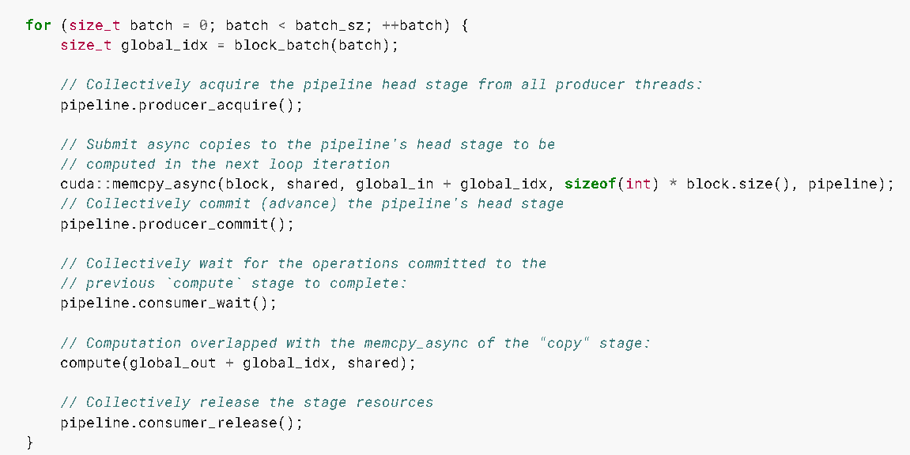

## Asynchronous Data Copies

### 7.27.1 API

异步：操作不需要等待前一个操作完成即可开始

memcpy_async

cooperative_groups::memcpy_async

`memcpy_async` API 主要用于在设备端内核中执行异步的数据传输操作，特别是从全局内存到共享内存的传输。它允许在内核执行期间重叠计算和数据传输，从而提高性能。

扩展：通过将cudaMemcpyAsync 与 CUDA 流结合使用，可以实现主机到设备的数据传输与内核执行的重叠。

> 协作组（cooperative groups 是 cuda9 引入的一种编程模型，用于在 GPU 上实现更高效的线程协作和同步），使用 `cooperative_groups::thread_block::sync()` 可以在协作组内同步所有线程，确保所有线程都执行到这一点后再继续执行后续的操作。

### 7.27.2 复制和计算模式

without memcpy_async : 需要使用中间寄存器

with memcpy_async : 不需要使用中间寄存器

### 7.27.3. Without `memcpy_async`

> shared[local_idx] = global[global_idx]
> 
> 全局至共享内存副本将从全局存储器扩展到寄存器，然后将其从寄存器写入到共享内存。

- 确保在计算阶段开始之前完成对所有共享内存的写入已经完成

- 为了防止所有线程完成计算之前覆盖共享内存，要在计算阶段之后再次同步

这种方式在完成数据拷贝期间，其他操作都不能进行，这样会导致性能下降。

### 7.23.4 With `memcpy_async`

cooperative_groups::memcpy_async(group, shared, global_in + batch_idx, sizeof(int) * block.size());

在拷贝数据完成之前，修改global data 或者 reading or writing the shared data 会造成数据竞争问题

memcpy_async 会通过硬件加速，避免通过中间寄存器传输数据

在执行 memcpy_async 异步拷贝操作时，拷贝过程跟前序的指令是异步执行的，不会阻塞当前线程的执行。为了确保数据一致性和避免数据竞争，需要在拷贝完成之后 cooperative_groups::wait 进行同步

在使用异步数据拷贝的情况下，数据拷贝操作与前序操作是同时进行的，而与后续操作之间的执行顺序取决于如何管理流和同步机制。比如数据拷贝操作与前序操作可以在同一个流中执行，也可以在不同的流中并发执行。

### 7.27.5. Asynchronous Data Copies using `cuda::barrier`

通过屏障同步来管理异步数据传输。

```cpp
__shared__ cuda::barrier<cuda::thread_scope::thread_scope_block> barrier;
if (block.thread_rank() == 0) {
    init(&barrier, block.size()); // Friend function initializes barrier
}
block.sync();
```

声明一个块级别的屏障同步对象barrier， 并在线程块的第一个线程中初始它。然后，调用 block.sync() 确保所有线程在继续执行之前都已经到达此点。

### 7.27.6. Performance Guidance for `memcpy_async`

> 管道机制（streams）被同一warp中的所有线程所共享。这种共享会导致 memcpy_async 被纠缠在warp中，这在某种情况下会影响性能。
> 
> 扩展：（CUDAstreams是管理GPU操作顺序的一种机制。在使用多个流时，数据传输操作，计算任务和内存访问可以在不同的流中并行执行。memcpy_async 允许异步数据传输，但这会受到流的同步机制的影响。）

在具备计算能力8.0的设备上，[cp.async family of instructions](https://docs.nvidia.com/cuda/parallel-thread-execution/index.html#data-movement-and-conversion-instructions-cp-async) 允许以异步方式将数据从全局内存复制到共享内存。这些指令支持一次拷贝4、8和16个字节。如果提供给`memcpy_async`的大小是 4、8 或 16 字节的倍数，并且传递给`memcpy_async`的两个指针都对齐到4、8或16对齐边界，那么`memcpy_async`就可以完全使用异步内存操作来实现。

为了在使用`memcpy_async` API 时获得最佳性能，共享内存和全局内存的对齐方式都必须是128字节。可以用以下方法实现内存对齐。

- 使用cudaMalloc 分配内存： 使用cudaMalloc分配全局内存的时候，返回的指针通常已经满足128字节对齐要求。

- 使用 `__align__`  关键字， 在定义共享内存和全局内存的时候，可以使用这个关键字来指定对齐方式：```__align__(128) int sharedMemory[SIZE];```

## 7.28. Asynchronous Data Copies using `cuda::pipeline`

- `producer_acquire` ： 获取流水线内部队列中一个可用阶段，使当前线程等待，知道流水线的生产者阶段可用。

- `producer_commit` :  提交在当前已获取的流水线阶段上，producer_acquire 调用之后发出的异步操作。提交生产者阶段的操作，表示数据已经准备好给消费者使用。

- `consumer_wait` : 等待流水线中最旧阶段的所有异步操作完成，使当前线程等待，知道流水线的消费者阶段完成前一个阶段的操作。

- `consumer_release` ： 将流水线中最旧的阶段释放回流水线对象来重复使用。释放的阶段随后可以被生产者重新获取。释放消费者阶段的资源，表示当前阶段的操作已经完成。循环处理下一个批次。

### 7.28.1 Single-Stage Asynchronous Data Copies using `cuda::pipeline`



代码实例中的compute ，可以与数据拷贝阶段重叠进行执行

### 7.28.2. Multi-Stage Asynchronous Data Copies using `cuda::pipeline`

### 7.28.3. Pipeline Interface

### 7.28.4. Pipeline Primitives Interface
