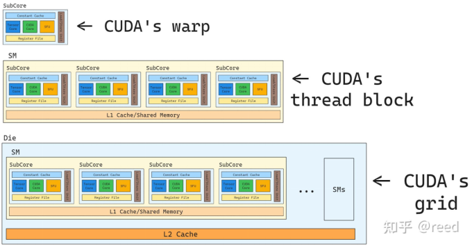

# 编程接口

# 3. 1 利用NVCC编译

### 3.1.1 编译流程

    源文件：主机上执行的代码 + 设备上执行的代码

nvcc 的基本工作流程：

> 将设备代码和主机代码进行分离

- 编译时：将设备代码编译成汇编形式（PTX代码） 或者二进制形式（cubin对象，cuda运行时可能需要将PTX进一步编译为特定的SASS代码）
  
  - PTX是中间表示，具有可移植性，可以在多个不同的GPU架构之间共享使用，运行时需要进一步编译（JIT编译 Just-In-Time Compilation及时编译）成特定架构的机器代码
  
  - cubin代码时已经针对特定架构编译好的机器代码，不需要做额外的编译操作

> PTX  ==>>   ```Parallel Thread Execution``` 
> 
> PTX是一种（类似汇编语言的，但是保留了一些高级语言的特性，类型系统，内存模型）中间表示，用于表示在NVIDIACUDA 编程环境中执行的程序。
> 
> PTX 位于位于高级cuda 代码和底层GPU机器代码之间，是一种面向GPU的编程语言，允许程序在不同的cuda架构版本之间进行移植。
> 
> PTX代码在运行时会再被编译成目标GPU架构的机器代码（最终的机器代码会在特定的GPU硬件上执行）

- 运行时：程序在GPU上执行时，CUDA运行时（CUDA Runtime）会检查是否有适合当前硬件的**CUBIN**文件。如果有，它会直接使用CUBIN文件中的机器代码。如果没有，则会从PTX代码中进行**JIT编译**，将其转换为适合当前GPU架构的机器代码（SASS），然后执行。
  
  > **启动延迟(这好像也被称为冷启动)**：因为JIT编译是在运行时进行的，所以程序的首次启动可能会有一定的延迟，尤其是当没有预编译好的CUBIN文件时。

- 通过```cuda```运行时中的函数调用来替换主机代码中的```<<<...>>>```语法，对主机代码进行修改，对主机代码进行修改，来从PTX代码或者```cubin```对象中加载和启动每个编译好的内核

### 3.1.2 Binary的兼容性：

> 二进制代码是特定于体系结构的，为计算能力为 X.y 生成的 `cubin` 对象只能在计算能力为X.z , z≥y 的设备上执行

### 3.1.3 PTX的兼容性

### 3.1.4 应用程序的兼容性

> 要在具有特定计算能力的设备上执行代码，应用程序必须加载与此计算能力兼容的二进制或 PTX 代码

### 3.1.5 C++ 兼容性

# 3.2 CUDA Runtime

* 在计算机编程中，链接是将代码和数据组合到一起，生成可执行文件或者库的过程。（可以将自己编写的类和函数打包成静态链接库或者是动态链接库，然后可以在项目中进行复用，这是模块化编程的一部分，能够提升代码的复用性，减少编译时间，并使得项目的结构更加清晰）
  
  * 静态链接（static linking）：在编译链接阶段就直接将所需要的库文件直接嵌入到可执行文件中。
    
    > lib 文件库 .a(linux中的静态链接库)
  
  * 动态链接（Dynamic linking）：在程序运行时将所需要的库文件加载到内存中。可执行文件并不包含库的代码，而是包含对库的引用。
    
    > dll 文件库 .so(linux中的动态链接库)
    > 
    > 若使用dll，dll不必被包含在最终的exe文件中，exe文件执行时可以“动态”地引用和卸载这个与exe独立的dll文件

* 采用动态链接库的优点：
  
  * 更加节省内存
  
  * dll文件与exe文件独立，只要输出接口不变，更换dll文件不会对exe文件造成任何影响，因而可以极大地提高可维护性和可扩展性

* 创建静态库和动态库
  
  * 静态库：（通常是 `.a` 文件在Linux系统上，`.lib` 文件在Windows系统上）
    
    > 可以使用ar（archive工具将目标文件打包成静态库）
    > 
    > 然后在编译链接项目时链接之前生成的静态库
    
    > ```c++
    > g++ -c MyClass.cpp -o MyClass.o    // 编译
    > ar rcs libmyclass.a MyClass.o      // 将目标文件打包成静态库    
    > // r:插入文件到归档库中，必要时替换已经存在的文件
    > // c:创建库
    > // s:索引库，确保库的索引是最新的
    > // 生成的libmyclass.a文件就是静态库文件
    > 
    > g++ main.cpp -L. -lmyclass -o my_program    // 在编译时链接之前生成的静态库
    > // -L. 表示链接库路径为当前目录（.）
    > // -lmyclass 表示链接 libmyclass.a 库
    > ```
  
  * 动态库：（通常是 `.so` 文件在Linux系统上，`.dll` 文件在Windows系统上）
    
    > 编译时需要使用 `-fPIC` 选项（Position Independent Code），这对动态库是必须的，因为动态库可以被多个进程加载到不同的内存地址。
    > 
    > g++ -fPIC -c MyClass.cpp -o MyClass.o    // 编译为目标文件
    > 
    > 使用 `-shared` 选项将目标文件打包成动态库
    > 
    > g++ -shared -o libmyclass.so MyClass.o    // 将目标文件打包成动态库
    > 
    > 生成的 `libmyclass.so` 即为动态链接库。
    > 
    > -
    > 
    > g++ main.cpp -L. -lmyclass -o my_program     // 编译时需要链接动态库
    > 
    > // 此时，my_program 可执行文件不包含动态链接库的实现代码，而是在运行的时候依赖动态链接库
    > 
    > // 在运行程序时候，操作系统会查找动态库的位置，如果库不在标准路径中（如 /usr/lib）需要自己手动指定库的路径
    > 
    > LD_LIBRARY_PATH=. ./my_program

### 3.2.1 初始化

> cuda上下文：用来管理和控制与GPU交互的状态

### 3.2.2 设备存储

> 内核代码并不是在设备内存中执行，而是在GPU的计算核心上执行
> 
> 设备内存主要用来存储数据，内核通过访问这些存储的数据来执行计算操作。GPU的计算核心才是内核实际运行的地方，内核通过使用寄存器，共享内存等快速缓存进行处理，并从设备内存中读取数据。
> 
> 因此运行时提供了分配，释放，和复制设备内存以及在主机内存和设备内存之间传输数据的功能。

- GPU设备内存有两种分配使用方式：
  
  - 线性内存（Linear Memory）：线性内存是最通用的内存形式，几乎适用于所有的数据访问模式。线性内存也可以通过 `cudaMallocPitch()` 和 `cudaMalloc3D()` 分配。（这些函数可以用于2D或者3D数组的分配，因为它可以确保分配的内存会被适当地填充以满足设备内存访问中描述地对齐要求）（cudaMalloc/cudaMallocPitch/cudaMalloc3D）
    
    > cudaMalloc 常规地申请一块连续内存
    > 
    > cudaMallocPitch 用于在设备上分配2D数组内存地函数//参数pitch为了保证内存对齐(行对齐)（pitch每行的实际字节数）
    > 
    > float* row = (float*)((char*)devPtr + r * pitch);
    > 
    > // 将 `devPtr` 强制转换为字符型指针 `char*`，这样可以按字节进行偏移。
    > 
    > // 核函数通过偏移计算二维数组中的每行起始地址，并逐行遍历访问数组元素
    > 
    > // 优点：会确保分配地内存在行之间有适当地对齐，从而提高内存访问效率
  
  - cuda数组：cuda数组是专门为纹理和表面内存设计的内存形式，适用于图像处理，矩阵操作等涉及多维数据的操作。与线性内存不同，cuda数组并不适用普通的指针进行访问，而是通过cuda的纹理和表面内存机制进行访问。
    
    > 使用cudaMallocArray 函数分配cuda数组。分配一个二维的cuda数组↓
    > 
    > cudaArray*  d_array;    // 声明了一个指向cuda数组的指针
    > 
    > cudaChannelFormatDesc channelDesc = cudaCreateChannelDesc<float>();    // 这里创建了一个通道描述符cudaChannelFormatDesc，描述了cuda数组中每个元素的数据格式
    > 
    > cudaMallocArray(&d_array, &channelDesc, width, height);
    > 
    > // 作用是在设备内存中分配cuda数组的函数。
    > 
    > // &d_array: 设备上分配的数组将存储到d_array 中
    > 
    > // &channelDesc: 指定数组中每个元素的格式
    > 
    > // width 和 height： 指定cuda数组的二维大小，分别表示宽度和高度

### 3.2.3 L2 级设备内存管理



> L2缓存是整个GPU的共享缓存，它为所有的SM提供统一的缓存服务。其主要作用是缓存来自全局内存的数据，以减少频繁访问全局内存带来的延迟。

> 当某个SM访问全局内存时，数据首先会被存储到L2cache中，如果其他SM也需要访问这些数据，它们可以从L2缓存中读取，避免再次访问全局内存

- 持久化的： cuda内核重复访问全局内存中的一个数据区域时

- 流式的：数据只被访问一次

#### 3.2.3.1 为持久访问预留L2缓存

> 留出一部分L2缓存用于对全局内存的持久化访问。
> 
> 持久化访问优先使用L2缓存的这个预留部分，而对全局内存的访问来说，无论正常访问还是流式访问，它都只能使用那些未被持久化访问使用的L2缓存
> 
> 用于持久化访问的L2缓存预留大小可以被修改：（这里的可以被修改是指通过cuda提供的API来控制缓存的使用方式和策略）
> 
> - 在cuda程序中用于配置GPU的L2缓存，其中涉及到设置一个用于持久访问的L2缓存大小的操作。
>   
>   - **`cudaGetDeviceProperties(&prop, device_id);`** // 获取设备GPU相关的属性，并将这些属性存储在prop结构体中，device_id 可以指定具体哪一个设备（prop是一个cudaDeviceProp类型的结构体，里面包含设备的各种属性，比如设备名，计算能力，L2缓存大小等）
>   
>   - **`size_t size = min(int(prop.l2CacheSize * 0.75), prop.persistingL2CacheMaxSize);`**// 计算要预留给持久化访问的L2缓存大小
>     
>     - `prop.l2CacheSize` 是从设备属性中获取的 L2 缓存的总大小。
>     
>     - `prop.l2CacheSize * 0.75` 计算出 3/4 的 L2 缓存大小。
>     
>     - `prop.persistingL2CacheMaxSize` 是设备支持的最大持久 L2 缓存大小。
>   
>   - **`cudaDeviceSetLimit(cudaLimitPersistingL2CacheSize, size);`** 这一行代码通过调用 `cudaDeviceSetLimit()` 来设置 GPU 的 L2 缓存分配限制。

#### 3.2.3.2 L2持久化访问策略

#### 3.2.3.3 L2访问属性

> 为不同的全局内存数据访问定义了三种类型的访问属性

- **`cudaAccessPropertyStreaming`**: 使用流属性产生的内存访问不太可能在L2缓存中持久存在，因为这些访问会优先被清除。

- **`cudaAccessPropertyPersisting`**: 使用持久属性产生的内存访问更有可能持久存在于L2缓存中，因为这些访问会被有限保留到L2缓存的预留部分中。

- **`cudaAccessPropertyNormal`**:此访问属性，会强制将先前的应用的持久访问属性重置为正常状态。从以前的 CUDA 内核中获得的带有持久化属性的内存访问可能会在使用后很长时间内都保留在L2缓存中。这种使用后的持久性减少了 L2 缓存量，这些 L2 缓存本来可被后续不使用持久化属性的内核所使用。使用 `cudaAccessPropertyNormal` 属性重置访问属性窗口会移除先前访问所产生的持久化（优先保留）状态，使得先前访问就像没有访问属性一样。

```csharp
cudaAccessPolicyWindow policyWindow;
policyWindow.base_ptr = dev_ptr; // 要应用缓存策略的全局内存指针
policyWindow.num_bytes = size_in_bytes; // 访问的字节数
policyWindow.hitRatio = 0.9; // 缓存命中率目标
policyWindow.hitProp = cudaAccessPropertyPersisting; // 设置为持久化属性
policyWindow.missProp = cudaAccessPropertyStreaming; // 缓存未命中时采用流式访问属性
cudaStreamSetAccessPolicy(stream, &policyWindow);
```

在这个例子中，程序设置了一个基于 `dev_ptr` 的缓存访问窗口，当缓存命中时，访问属性为 `cudaAccessPropertyPersisting`，意味着该数据将被优先保留在 L2 缓存中。缓存未命中时，使用流式访问属性，即 `cudaAccessPropertyStreaming`，表明这些数据不需要长期保留。

在多内核的执行过程中，如果某些数据已经不再需要频繁访问，可以使用 `cudaAccessPropertyNormal` 来重置缓存策略，确保后续内核能够使用 L2 缓存，而不是被无效的持久性数据占据。

#### 3.2.3.4 L2持久性示例

> 为持久化访问预留了L2 缓存，通过cuda stream在cuda内核中使用预留的L2缓存，然后重置L2缓存。
> 
> - 为什么要给持久化访问预留L2缓存
>   
>   - 减少全局内存的访问延迟
>   
>   - 提高内存带宽利用率
>   
>   - 优化数据重用
>   
>   - stream并行处理的高效性
>   
>   - 减少缓存抖动
>   
>   - 提高内核性能和执行效率
>   
>   - 重置L2缓存确保缓存一致性

#### cuda stream:

> cuda stream : a sequence of operations that execute on the device in the order issued by host code

每个流之间异步执行，单个流内部顺序执行。

多流操作以实现kernel级或者说是kernel外部实现并行。之前都是kernel内部的并行手段

> 一般来说，cuda c并行性表现在下面两个方面上
> 
> - kernel level
> 
> - grid level
> 
> 之前我们讨论的一直都是kernel level的，也就是一个kernel或者一个task由许多thread并行的执行在GPU上。stream的概念相对于后者来说，grid level是指多个kernel在一个device上同时执行
> 
> cudaMemcpy 这是一个同步操作，当前的CPU线程会等待数据传输完成之后才会继续执行。CPU无法执行其他操作，直到拷贝操作结束
> 
> cudaMemcpyAsync 这是一个异步操作，允许在指定的cuda stream中进行数据传输。CPU线程不需要等待数据传输完成就可以继续执行后续代码。传输操作会在后台并行执行，与CPU和其他stream中的操作并行。只有在GPU上显示同步时，才会等待传输完成。什么时候使用cudaMemcpyAsync，当想要并行进行数据传输和计算的时候，当希望最大限度地利用GPU和CPU地资源而不让CPU因为等待数据传输而闲置时。在处理大量数据传输地场景下，异步传输可以与其他计算操作重叠，减少数据传输时候的开销。

#### 3.2.3.5 将 L2 Access 重置为 Normal

见3.2.3.3L2 访问属性

> 在多内核的执行过程中，如果某些数据已经不再需要频繁访问，可以使用 `cudaAccessPropertyNormal` 来重置缓存策略，确保后续内核能够使用 L2 缓存，而不是被无效的持久性数据占据。

有三种方式可以将L2重置为Normal

1. 使用访问属性`cudaAccessPropertyNormal`重置之前的持久化内存区域。
2. 通过调用`cudaCtxResetPersistingL2Cache()`将所有持久化 L2 缓存行重置为正常。
3. **最终**，未触及的缓存行会自动重置为正常。对自动复位的依赖性很强。

#### 3.2.3.6 管理L2预留缓存的利用率

#### 3.2.3.7  查询 L2 缓存属性

CUDA 设备属性包括：

- `l2CacheSize`：GPU 上可用的二级缓存数量。
- `persistingL2CacheMaxSize`：可为持久化内存访问留出的 L2 缓存的最大数量。
- `accessPolicyMaxWindowSize`：访问策略窗口的最大尺寸。

#### 3.2.3.8 控制 L2 缓存的预留大小来持久内存访问

### 3.2.4 Shared Memory

> 共享内存是每个SM的局部内存，通常用于线程块内线程之间进行快速交换数据。内存共享与L1缓存不同，它是显示管理的，需要由程序员决定如何在内存中分配和使用

#### L1 缓存、L2 缓存和共享内存的交互：

##### (1) **L1 缓存与 L2 缓存的交互**：

- 当 GPU 线程请求访问全局内存时，数据首先会检查是否存在于 L1 缓存中。如果命中（Hit），则可以从 L1 缓存中直接读取；如果未命中（Miss），L1 缓存会向 L2 缓存请求数据。
- 如果 L2 缓存中有数据，则直接从 L2 缓存中读取，之后数据会缓存在 L1 中以供未来访问。如果 L2 缓存也未命中，则需要从全局内存读取数据，并将数据放入 L2 和 L1 缓存中。

##### (2) **共享内存与 L1 缓存的关系**：

- **共享内存**和 **L1 缓存**共享同一套硬件资源，但它们的功能和访问模式不同。共享内存是由程序员显式控制的，而 L1 缓存是自动管理的。
- 共享内存不需要通过 L2 缓存或 L1 缓存进行访问，因为它是专门为线程块提供的直接存储区域。通常，它被设计为非常低延迟的存储器，直接连接到各个 SM。

##### (3) **L2 缓存与共享内存的关系**：

- **共享内存**和 **L2 缓存**之间没有直接的交互。共享内存是局部的、显式管理的，而 L2 缓存是全局的、隐式管理的。共享内存用于线程块内的快速数据交换，而 L2 缓存则用来缓存全局内存中的数据，供所有 SM 使用。
- 共享内存的数据不会被放入 L2 缓存中，因为它们是局部存储，仅限于当前 SM 和当前线程块。L2 缓存主要用于缓存来自全局内存的数据，而不是共享内存中的数据。
