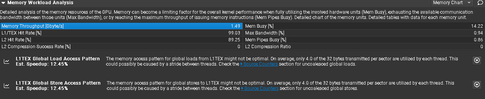
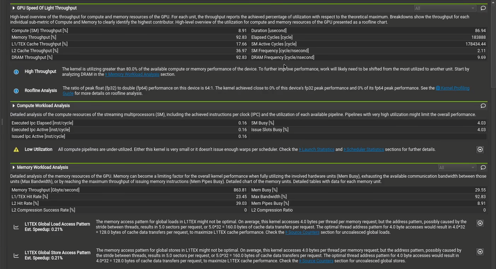
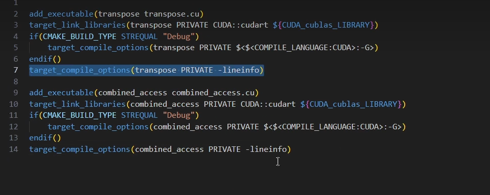

- **Memory Bandwidth Boundary** - The memory bandwidth boundary is the *sloped* part of the roofline. By default, this slope is determined entirely by the memory transfer rate of the GPU but can be customized inside the *SpeedOfLight_RooflineChart.section* file if desired.  
  **内存带宽边界** - 内存带宽边界是屋顶线的*倾斜*部分。默认情况下，此斜率完全由 GPU 的内存传输速率决定，但如果需要，可以在 *SpeedOfLight_RooflineChart.section* 文件中进行自定义。

TMPDIR=/home/sunwei/tmp ncu -c 1  --config-file off --set full --kernel-name matMult --force-overwrite -o ./result/result ./build/GEMM/GEMM_native

TMPDIR=/home/sunwei/tmp ncu --config-file off --set full --kernel-name sgemm_naive --force-overwrite -o ./result/kernel0_cublas ./build/sgemm 1

TMPDIR=/home/sunwei/tmp ncu --config-file off --set full --kernel-name sgemm_shared_mem_block --force-overwrite -o ./result/single16384_4090/kernel3_run_sgemm_shared_mem_block_4090_single16384 ./build/sgemm 3

- cublas

TMPDIR=/home/sunwei/tmp ncu --config-file off --set full --force-overwrite -o ./result/kernel0_cublas_4090_all_v16384 ./build/sgemm 0

当前带宽（blue）

向量加法，内存带宽利用率竟然能达到 92% ！！！！！ 为什么

加上这个 -lineinfo 可以看行数

