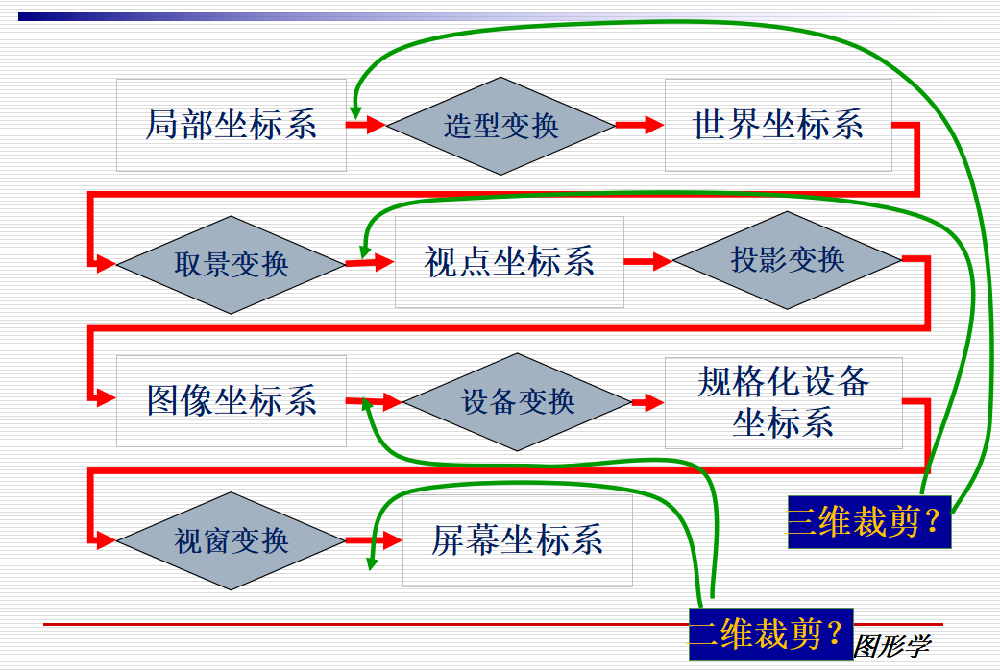
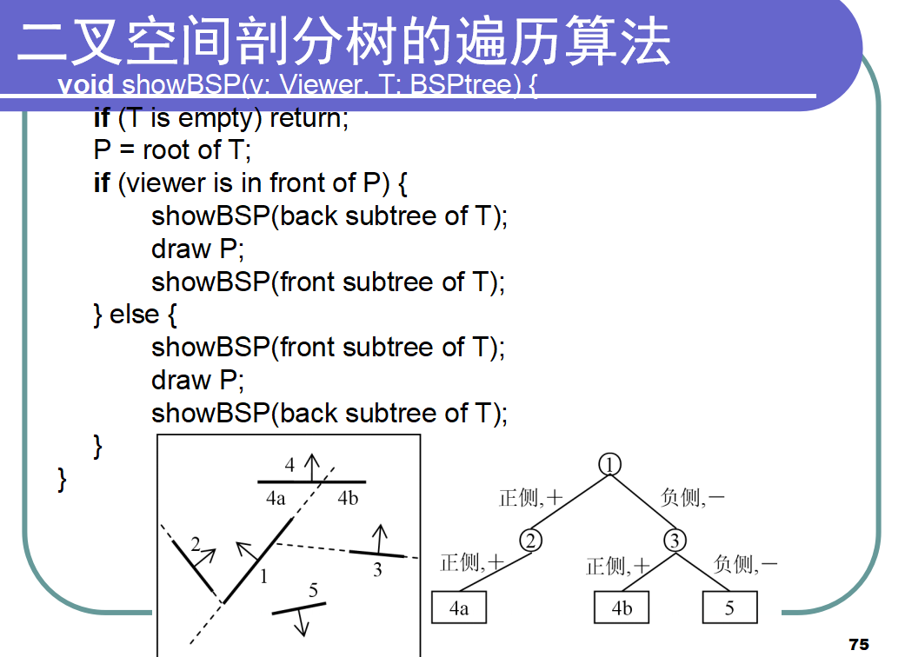

# 复习重点

## 第一章 绪论

### 图形学和图像学的区别

### 走样的原因和反走样的概念

## 第二章 颜色模型

### 什么是设备无关的颜色模型

### 什么是设备相关的颜色模型

### RGB和CMY颜色模型的比较

### 那些颜色模型是设备相关的，那些颜色模型是设备无关的

## 第三章 物体表示

### 什么是建模坐标系，和世界坐标系的区别

### OBJ数据结构

### 什么是BREP，其结构中包含哪些信息

### 半边数据结构

### 多边形的优缺点

### Bezier 曲线的优缺点

**优点**

- 凸包性：Bézier曲线位于控制多边形的凸包内

- 几何不变性：Bézier曲线的形状仅与控制多边形有关，与坐标系无关

**缺点**

- 当移动曲线的一个控制顶点时，整条曲线的形状都会发生改变

- 表示复杂形状时，需要将多条Bézier 曲线光滑拼接起来，即Bézier样条曲线。

### NURBS曲线和B样条曲线的改进是什么

**NURBS曲线**

- B-样条情形不能精确表示二次曲面与平面的交线，如圆锥曲线(平面与圆锥的交线)

- NURBS曲线新增加的曲线控制手段是权因子

**B样条曲线**

- B-样条曲线多项式独立于控制点数目

- B-样条允许局部控制曲线或曲面

### 参数曲线的优缺点

**优点**

- 对每一个参数值，可以直接计算曲面上的对应点

- 参数表示的物体可以方便地转化为多边形逼近表示

- 曲面上的几何量计算简便(微分几何)：法向、曲率、测地线、曲率线等

- 特殊形式的参数表示的外形控制十分直观
  Bézier、B-样条、NURBS (Non-Uniform Rational B-Spline, 非均匀有理B-样条)曲线/曲面

### 细分曲面的作用

### 细分曲面的原理

### Catmull-Clark subdivision

Catmull-Clark细分是一种四边形网格的细分法则，每个面计算生成一个新的顶点，每条边计算生成一个新的顶点，同时每个原始顶点更新位置。

### 有哪些常见的细分规则

常见的细分规则有Catmull-Clark细分，Doo-Sabin细分，Loop细分等

### 细分曲面的翼边存储

### 物体的CSG表示

CSG：Constructive Solid Geometry

- 表示实体：即有边界，也包含内部

- 表示边界：多边形、参数曲面、隐式曲面、细分曲面

CSG树：通过一系列几何操作将简单的基本体素组合起来

- 基本体素：立方体、球、圆柱、圆锥等

- 几何操作
  
  - 布尔运算：并、交、差、补等
  
  - 几何变换：平移、旋转、放缩、剪切等

### 什么是分形几何

分形(Fractal)几何的主要特征 ：

- 自相似性质：分形物体的任何一个部分都和物体整体具有某种程度的相似 

- 无限小细节性质：当无限地放大分形物体时，物体总是表现有细节，而不是像欧氏空间的物体一样最终会表现出光滑性 

- 维数非整数

### 分型维数计算

### L-系统，能够用L-系统绘制物体

L-系统

- 语法规则：根据语法规则对所给字符进行迭代生成新字符串，每次迭代结果称为一代

- 字符解释：将字符串中的字符解释为适当的几何体素，就可以得到一个基于语法规则生成的物体

L-系统成功地用于植物建模

## 第四章 pipleline

### 掌握图形渲染通道由那几个部分组成

Modeling Transforms

Lighting Calculations

Viewing Transform

Clipping

Projection Transform

## 第五章 变换

### 齐次坐标系及其作用

### 二维平移，旋转、缩放矩阵

平移

旋转

放缩

### 理解模型变换、取景变换、投影变换、设备变换、视窗变换的作用

**模型变换**

- 物体从建模坐标系到世界坐标系的转换

- 三维线性和非线性的转换

**取景变换**

- 由世界坐标系到视点坐标系的变换

**投影变换**

    投影变换，三维到二维 ， 投影变换是在视点坐标系CUVN中进行的

- 透视投影：符合人类的视觉特点，产生的投影效果更为真实

- 平行投影：物体的相对度量保持不变，适用于建筑和机械设计

**设备变换**

投影后二维齐次坐标除以最后一个坐标分量w，便得到了规格化设备坐标

**视窗变换**

- 二维变换：将定义在视窗中的规格化设备坐标转换到以像素为单位的屏幕坐标 

- 扫描转换：将连续的几何物体转换为离散的光栅表示 

### 一点透视、两点透视、三点透视

## 第六章 剪裁

### 二维剪裁和三维剪裁在渲染pipeline中的位置

裁剪是确定场景或者画面中位于给定区域（2D 或者 3D裁剪窗口） 之内的部分

裁剪还可用于图形反走样、隐藏线、隐藏面、阴影、纹理等算法中

### Cohen-Sutherland裁剪算法

### 中点分割算法

## 第七章 光栅化

### 区域填充算法及其递归函数实现

区域填充的类型

- 四连通邻域

- 八连通领域

填充算法以及递归函数实现

### 扫描线算法中如何判断一个点是在面内还是面外

### 分类的边表ET构建方法

**分类的边表ET**

分类的边表是按照边的下端点的纵坐标y对非水平边进行分类的指针数组

- 下端点的纵坐标y值等于i的边，归入第i类

- 同一类中，各边按x值( x值相等时，按dx的值)递增的顺序排成行

- 水平边不加入分类边表中 

### 活化边链表AEL构建方法

## 第八章 曲面消隐

### 图像空间算法，及其特点 Image space : Z-buffer algorithm

### 对象空间算法 Object space : back surface culling & list priority methods

### Z-buffer算法，及其优缺点

### 如何检测后向面

### 画家算法原理，及其特性

### 二叉空间剖分树构建过程

### 二叉空间剖分树遍历过程

### Area Subdivision算法原理

### 有哪些常用的消隐算法

## 第九章 真实感图形绘制

### 基础的光照模型

> 光照明模型考虑物体表面上每一个点所代表的微小面元受到来自光源或周围环境光线的照射而产生的反射或透射光亮度

- Lambert漫反射模型构成
  
  - 直接光源对物体表面的照射有方向性
  
  - 物体表面的反射光分为，漫反射光，镜面反射光
  
  - 纯漫射表面只产生漫反射
  
  - 漫反射光是物体表面对入射光线朝各个方向的均匀反射
  
  - 漫反射光亮度和光源入射角（入射光线和表面法向量的夹角）的余弦成正比

- Phong镜面反射模型构成
  
  - 镜面反射光 一种朝向一定方向的反射光，它遵从光的反射定律
  
  - Phong采用余弦函数的幂次来模拟镜面反射光
  
  - 

- Whitted整体光照明模型构成
  
  - Whitted模型：整体光照明模型，可模拟现实世界中景物表面之间的镜面反射和透射现象
  
  - 假设从某一观察方向V所观察到的物体表面某点P的光亮度的贡献来自于三个方面：
    
    - 由光源直接照射引起的反射光亮度Ic
    
    - 镜面反射光
    
    - 规则透射光
  
  - Whitted整体光照明模型

### 基础的明暗处理模型

- Flat Shading

- Gouraud Shading

- Phong Shading

### 光线跟踪算法步骤

### 光线树生成过程

### 终止条件

### 光线跟踪的4类光线

### 包含阴影的phone模型

### 光线跟踪加速技术：包围盒技术，空间分割技术

### 纹理分类

### 纹理的两种映射方法

### 常用纹理反走样方法：前置滤波方法，超采样方法，Mipmap方法

### Mipmap映射方法原理 常用的三维纹理：凹凸映射，法向映射，位移映射，及其原理

### 辐射度系统方程 辐射度算法流程 Gathering方法与Shooting方法的区别

### 本影与半影的区别 Depth Fail计算方法 Depth Pass计算方法 什么是LOD技术 三角形带方法点传输序列 三角形扇方法点传输序列

## 第十章 OpenGL

### 能够用Opengl实现简单图形绘制 能够用Opengl实现简单光线场景的设置
