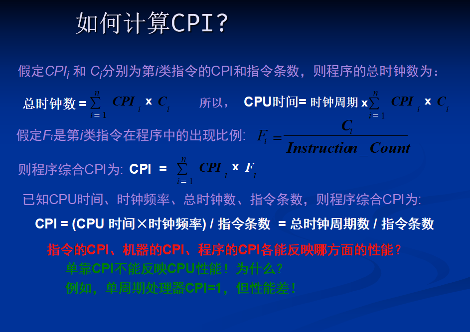
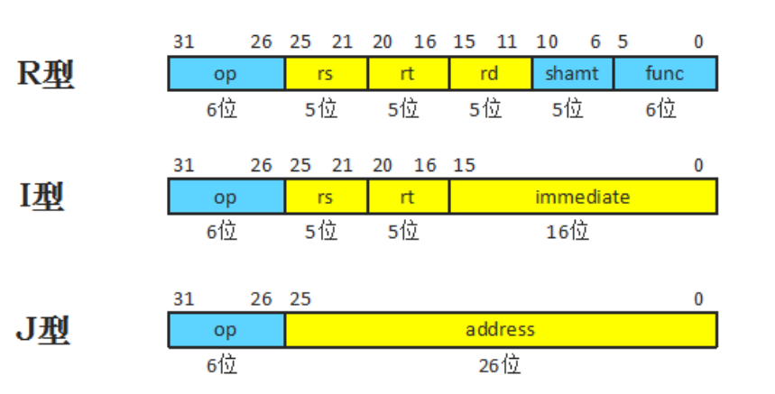

# 高级计算机系统结构复习提纲

## 第一章 量化设计与分析基础

1. 计算机的分类类别
2. 计算机系统结构定义和计算机的设计任务：指令集结构概念及要素
3. 实现技术的趋势：技术发展的趋势
4. 集成电路功耗的趋势：功耗的概念
5. 可靠性：提高可靠性的方法
6. 测量、报告和总结计算机性能：计算机主要性能指标
7. 计算机设计的量化原则：Amdahl定律

**计算机的分类**

- Flynns 分类： 基于指令流 和 数据流 数量的计算机结构分类

SISD （单指令单数据）

> 单指令 ： 在任一时钟周期只有单个指令流在 CPU 上执行
> 
> 单数据 ： 在任一时钟周期只有单个数据流用作输入
> 
> 确定执行 ： 程序在给定的输入条件下多次运行， 执行流程和结果是一致的

MISD （多指令单数据）

> 每个数据流进入多个处理单元
> 
> 每个处理单元用单个指令流对数据进行独立操作

SIMD  （单指令多数据）

> 一种并行计算机： 处理数据级并行
> 
> 单指令：在任一时钟周期，所有处理单元执行相同指令
> 
> 多数据：每个处理单元能够对不同数据元素进行操作

MIMD    (多指令多数据)

> 并行计算机：线程级 或 任务级并行
> 
> 多指令： 每个处理器可以执行不同的指令流
> 
> 多数据： 每个处理器可以对不同数据流进行操作
> 
> 各个处理器执行可以是同步的或者是异步的，确定性的或者非确定性的
> 
> 比 SIMD 更灵活，适应性更强。很适合任务级并行，也可以开发数据级并行，开销比SIMD高

FLynn 分类模型是抽象和粗略的

现代的不少并行处理器是 SISD， SIMD和 MIMD 的混合类型

- 市场分类：
  
  个人移动设备，桌面计算机，服务器，集群/仓库级计算机，嵌入式计算机

**计算机系统结构的概念**

由程序员 （机器语言）看见的计算系统属性，即概念性结构和功能的行为，以区分数据流动和控制逻辑设计的组成以及物理实现

**练习**

- 主存容量与编址方式（按位，按字节，按字访问等）的确定属于计算机系统结构

- 为达到所定性能价格比，主存速度应多快，在逻辑结构上需采用什么措施，属于计算机组成

- 主存系统的物理实现，如存储器器件的选定，逻辑电路的设计，微组装技术的选定属于计算机实现 

**计算机设计的任务**

- 定义用户的需求

- 确定一台新计算机的重要属性，必须是在考虑成本，功耗，可用性等限制下使其性能最优

**实现技术的趋势**

摩尔定律

- 集成电路逻辑技术

- 半导体 DRAM

- 磁盘技术

- 网络 

**一些概念**

带宽/吞吐量 : 在给定时间完成的工作总量

时延/响应时间： 一个事件从开始到完成的时间

**经验法则**

带宽增加速度与时延平方改进速度成比例

**集成电路功耗的趋势**

功耗对芯片的规模也提出了挑战

功耗与面积成正比

单核性能与面积增加倍数的一半成正比

多核有更高的功率利用率

**可靠性，提高可靠性的方法**

可靠性：广义上包括可靠性，安全性和可用性

计算机的可靠性：用于表示系统提供给用户服务的质量

**提高可靠性的方法**

冗余：

- 时间冗余：重复操作直到没有错误

- 资源冗余：配置另外的相同部件，有错时用于替代出错部件

**计算机主要的性能指标**

定义性能：性能对不同的人意味着不同的事情，因此评价性能是很微妙的

**比较机器性能的指标**

执行时间

吞吐量：网站服务器

MIPS - millions of instructions per second

**用程序集比较机器性能**

选择适当的程序评估性能

不同的平均值

**性能指标 - 响应时间**

- 墙钟时间
  
  - 程序开始执行到结束看钟知道的时间，就是墙钟时间，也称为响应时间或者是消逝时间
  
  - 测量用户感受到的系统速度

- 墙中时间的问题
  
  - 如果一个机器上运行多个程序
  
  - 如果程序运行时需要用户输入

**性能指标 - CPU时间**

- 测量 CPU时间 更具有可计算性 （not waiting for I/O）
  
  - 测量设计者感受到的 CPU 速度

- CPU 时间进一步分为
  
  - 用户 CPU 时间 - 花费在用户模式的时间
  
  - 系统 CPU 时间 - 花费在 OS 的时间

- Unix时间命令报告 CPU 时间

**性能指标 - 吞吐量**

- 单位时间内完成的工作总量
  
  - 测量管理员感觉到的系统性能

- 常用吞吐量测量
  
  - 每天产生的代码行的数量
  
  - 每秒处理的事务数量，如每秒服务的网页数量

- 处理器性能 一半仅使用时延指标：程序A 比 程序B 快 10 倍

- 对于很多应用，吞吐量比时延更重要：金融市场，政府统计

**响应时间和吞吐量**

- 通常改善了响应时间 也会改善 吞吐量
  
  - 处理器用更快的型号替换

- 只改善吞吐量 而不改善响应时间
  
  - 在一个系统中增加额外的处理器，如多处理器

**计算机设计的量化原则**

- 利用并行性

并行性的层次 ： 

> 系统级：多线程，多个处理器
> 
> 指令级：流水线，超标量
> 
> 操作级：并行加法器，组相联cache，功能部件流水线

- 局部性原理

程序特性：趋于重用最近用过的数据和指令

时间局部性（Temporal locality） 和 空间局部性（Spatial locality）

- 注重经常性事件

计算机设计最重要和普遍原则：功耗，资源分配，性能，可靠性

经验法则：simple is fast

简化常用事件，速度能够更快。CPU中两个数相加，结果可能产生溢出，溢出情况较少，不溢出才是常见情况。因此，可以通过简化不溢出相加的操作来提高机器的性能。

- Amdahl's 定律

加速比反映了使用改进措施后完成一个 任务比不使用改进措施完成同一任务加快的比率。

要直接测量使用新改进措施的改进时间是困难的。所以使用 CPU 性能公式进行判断

- CPU 性能公式

CPI：Cycles Per Instruction,每条指令执行所花的时钟周期数。对于某一条特定的指令，其CPI是一个确定的值。对于某一个程序或一台机器，其CPI是一个平均值，表示该程序或该机器指令集中一条指令执行时平均需要多少个时钟周期。所以 CPI = CPU时钟周期数 ÷指令条数

CPU 执行时间 = CPU时钟周期数 × 时钟周期
                        = CPU时钟周期数 ÷ 时钟频率
                        = CPI ×指令条数 × 时钟周期

CPU 性能取决于3个特征：

- clock cycle (or rate)        ( CCT )

- clock cycles per instruction ( CPI )

- instruction count.            ( IC )

## 第二章 指令系统原理与实例

指令集系统结构（Instruction Set Architecture ISA），即计算机硬件对程序员和编译器开发者可见的部分

1. 指令集系统结构的分类：指令集系统的不同结构

指令集系统结构最根本的区别：在于处理器内部数据的存储结构不同

**存储结构** ： 堆栈，累加器或一组寄存器。操作数可以显式指定或者隐含指定。

- 堆栈系统结构中操作数隐含地位于栈顶

- 累加器系统结构中的一个隐含操作数就是累加器

- 通用寄存器结构系统中只能明确地指定操作数，不是寄存器就是存储器地址

按照 通用寄存器访问方式划分，有两种通用寄存器系统结构的计算机:

- register-memory 系统结构，一般指令都可以访问存储器。

- register-register 或者 load-store 系统结构，只能通过 load 和 store 指令来访问内存

教材中提到的纯 memory-memory 系统结构，现实中不存在的结构，把所有的数据都保存在存储器中

1. 存储器寻址：大小端模式及地址对齐
2. MIPS系统结构：MIPS指令集结构

**通用寄存器出现的原因**

- 寄存器比存储器快

- 编译器使用寄存器很方便，比使用其他存储形式效率更高

- 寄存器用来存放变量，减少了数据流量，加速程序运行（寄存器比存储器快）；改善代码密度（寄存器地址比存储器地址的位数要少）

**存储器寻址**

小端模式&大端模式

小端模式把地址为“X…X000”的字节放在整个字的最低有效位置上（低地址存低字节）,字节序号为：

| 7   | 6   | 5   | 4   | 3   | 2   | 1   | 0   |
| --- | --- | --- | --- | --- | --- | --- | --- |

大端模式把地址为“X…X000”的字节放在整个字的最高有效位置上（低地址存高字节）,字节序号为：

| 0   | 1   | 2   | 3   | 4   | 5   | 6   | 7   |
| --- | --- | --- | --- | --- | --- | --- | --- |

**MIPS系统结构：MIPS指令集结构**

一种简单的 64 位 load-store 系统结构

固定长度指令编码，译码简单，有利于实现高效率流水线

使编译器更容易产生高效的目标代码

**MIPS寄存器**

32 个 64 位通用寄存器（GPR）

32 个 浮点寄存器（FPR）-- 既可以作为 32 个 32 位单精度寄存器来使用，也可以作为 32 个64 位双精度寄存器来使用

**MIPS 数据传输的寻址方式**

16位立即数

16位位移量方式（基址寻址），即操作数地址是一个存放在寄存器中的基地址与相对该基址的一个16位移量相加获得。

位移量为0---寄存器间接寻址

R0作为基址寄存器---16位绝对寻址

**MIPS指令格式**

 指令长度：32位，其中6位是基本操作码。可以使机器更容易进行流水线操作和译码。

两种存储器寻址方式：编码到操作码中。

**指令类型**

I 型指令：跳转寄存器，跳转并链接寄存器 （rt = 0 ，rs 表示目标，）

R型指令：移位，读写专用寄存器

J型指令： 跳转，跳转并链接，陷阱和从异常中返回

**MIPS操作**

大致分为四类：载入和存储、ALU操作、分支与跳转、浮点操作。

所有通用寄存器与浮点数寄存器都可以被载入或存储，唯一的例外是载入R0无效。

所有的ALU指令都是寄存器-寄存器指令，包括算术和逻辑操作：加、减、与、或、异或和移位。

**MIPS控制流指令**

控制由一组跳转与一组分支来处理

**MIPS浮点操作**

浮点指令对浮点数寄存器进行操作，并指出操作数是单精度（SP）还是双精度（DP）。

MOV.S和MOV.D分别把一个单/双精度浮点数寄存器的值复制到另一个同类型的寄存器中。

## 第三章 单周期MIPS处理器的设计

1. add, sub, addi, subi, lw, sw, beq, j 每条指令在单周期处理器中的执行逻辑

2. 上述指令的指令编码、代码、功能以及在单周期中的数据通路，条件分支指令的地址计算、单周期各功能部件的控制信号值判断

3. 中断和异常的处理时机

--- 

**基本CPU设计步骤**

- 分析设计指令集

- 建立数据通路（如存储部件，ALU，多路选择器）

- 分析出所有指令需要的控制信号，建立控制信号真值表；

- 用逻辑电路实现控制信号真值表，形成产生控制信号的控制部件。

--- 

**要实现的MIPS的指令子集**

- 存储器访问指令 （I 型指令）

- 算术逻辑指令 （R 型指令）

- 分支与跳转指令 beq（I型指令），J （J 型指令）

--- 

**<mark>基本的MIPS指令执行步骤（MIPS一条指令的执行步骤）</mark>**

- 取指令（根据程序计数器 PC 的值读存储器取出要执行的指令，然后PC 内容加4。 ）

- 分析指令与取操作数 ：分析指令中的 6 位op （R 型还要分析 6 位 func），产生相应的控制信号送对应部件。 R型或I型指令，根据rs、rt操作数字段，读取1或2寄存器、或立即数送ALU(运算器)。

备注：实现每条指令的第一步是相同的，与具体的指令类型无关。其后的步骤与具体的指令类型相关。

- 执行指令
  
  - 存储器访问指令lw或者sw：ALU计算访存有效地址
  
  - 运算类指令：ALU根据控制信号完成指令运算
  
  - 分支指令：利用ALU比较 rs 与 rt 是否相等。如果条件成立，计算转移地址并送入 PC

- 访问存储器：
  
  - lw：根据有效地址读出存储器数据；
  
  - Sw：根据有效地址将读出寄存器 数据写到存储器中。

- 写回结果：
  
  - lw：将存储器读出数据写到rt寄存器中；
  
  - 运算类指令：将ALU结果写到rd寄存器中。

--- 

MIPS指令集的简洁规整使许多指令的执行类似，简化了实现过程：

- 除跳转指令，其余所有指令读取寄存器后，均使用算术逻辑单元（ALU）：
  
       load/store指令用ALU计算地址，算术逻辑指令用ALU执行运算，分支指令用ALU进行比较。

- 在使用ALU之后，完成不同指令所需的动作就有所不同：
  
  - load/store指令访问存储器读取数据和存储数据；
  
  - 算术逻辑指令或load指令将来自ALU或存储器的数据写入寄存器
  
  - 分支指令根据寄存器比较结果决定是否改变下一条指令地址，条件成立则转移；否则下一条指令地址默认是当前指令地址+4。

--- 

 MIPS 指令子集需要的主要部件

PC

加法器

存储器 取出指令、读写操作数

寄存器堆（32位） 读数据（rs, rd）写数据（rd, rt）

ALU

符号扩展部件

多路选择器

---

**数据通路部件分类**

- 组合逻辑部件 其组合逻辑部件输入为之前某时钟周期写入的数据，其输出可供之后某时钟周期使用

- 存储部件 时钟决定存储器和寄存器的状态单元何时被写入（状态单元随时可读）

---

## 第四章 流水线技术及指令级并行（非常重要）

1. 流水线的概念、分类

2. 流水线的时空图及性能指标计算

3. add, sub, addi, subi, lw, sw, beq每条指令在5级流水线的执行过程

4. 结构冒险、数据冒险和控制冒险的判断，以及需要暂停的时钟周期数的判断（控制冒险的解决性能依赖于分支地址计算阶段和分支条件判断阶段）

5. 结构冒险、数据冒险和控制冒险的解决办法

6. 流水线中处理中断和异常的方法

7. 记分牌动态调度算法、Tomasulo动态调度算法

**MIPS流水线及指令级并行技术**

**流水线的概念，分类**

流水线是利用执行指令操作之间的并行性，实现多条指令重叠执行的技术

当今，流水线是实现更快 CPU 的基本和关键技术

**流水线术语**

- 机器周期（流水线周期）：指令沿流水线移动一个流水段的事件。长度取决于最慢的流水段，一般是一个时钟周期。每个流水线周期从指令流水线流出一条指令。

- 吞吐量：单位时间从流水线流出的指令数

--- 

理想情况下：流水线的加速比等于流水线机器的段数

流水线减少了指令执行的平均时间 （减少了 CPI 或者时钟周期）

流水线技术（硬件实现）对编程者透明

---

为什么采用流水线

- 制造快速 CPU 的关键技术 ： 减少 CPU 时间

- 改进吞吐量

- 改进资源利用率

--- 

为什么不开发 50 段流水线或者更多：

- 有些操作不能分为更细的逻辑实现

- 流水线锁存器不是免费的，要占据面积，且有延迟

---

**流水线的分类（不重要，了解）**

- 按过程段用时是否相等分类
  
  - 均匀流水线
  
  - 非均匀流水线

- 按处理的数据类型
  
  - 标量流水处理机
  
  - 向量流水处理机

- 按流水线的规模
  
  - 操作流水线
  
  - 指令流水线
  
  - 宏流水线

- 按功能分类
  
  - 但功能流水线
  
  - 多功能流水线

- 按工作方式划分
  
  - 静态流水线
  
  - 动态流水线

- 按连接方式分类
  
  按照流水线的各个功能段之间是否有反馈信号
  
  - 线性流水线
  
  - 非线性流水线

---

**RISC指令系统特点**

- 所有参加运算的数据来自寄存器，结果也写入寄存器。寄存器为32/64位。

- 访存只有load和store指令

- 指令的数量较少，所有指令长度相同。

- 不同指令执行的时钟周期数差别不大

这种结构可以有效地简化流水线的实现

MIPS系统是默认的 RISC 系统结构

---

**流水线的时空图以及性能分析**

**时空图** ： 时空图从时间和空间两个方面描述了流水线的工作过程。时空图中，横坐标代表时间，纵坐标代表流水线的各个段（或级，即完成一条指令的一部分操作）

**流水线的性能分析**

吞吐率  ：在单位时间内流水线所完成的任务数量或者输出结果的数量。

流水线执行时间 = 第1条指令的执行时间 + (n - 1) × 流水线周期。

**流水线吞吐率**（TP）是指单位时间内完成的指令条数，计算公式为：TP = 指令条数 / 流水线执行时间。它反映了流水线的处理能力和效率。最大吞吐率则是指当指令条数趋于无穷大时，流水线的吞吐率将趋近于流水线周期的倒数（1/Δt）。

**加速比**是指完成同一批任务时，不使用流水线技术与使用流水线技术所需时间之比。计算公式为：S = 不使用流水线执行时间 / 使用流水线执行时间。加速比越大，说明流水线技术带来的性能提升越明显。

**流水线效率**是指流水线实际产出量与其最大产出量之间的比率。在计算机科学中，这一概念可以类比为流水线实际完成的指令条数与理论上可能完成的指令条数之比。然而，在工业生产中，流水线效率通常通过实际产出量与最大生产能力之比来计算。计算公式为：流水线效率 = 实际产出量 / 最大产出量 × 100%。

--- 

**解决流水线瓶颈问题的常用方法**

- 细分瓶颈段

- 重复设置瓶颈段（并行：如果瓶颈段难以分离时可采用）。缺点：控制逻辑比较复杂，所需的硬件增加了

---

**什么是数据冒险**

当前流水线的指令可能会阻止下一条连续指令在流水线中预期的时钟周期内执行

**流水线冒险分类**

冒险总是可以用停顿解决（解决冒险最简单的方式）

- 结构冒险
  
  如果某些指令组合在流水线中重叠执行时产生了资源冲突，那么我们称该流水线有结构冒险。
  
  对于这类冲突，通常有以下两种方法
  
  -  插入暂停周期，即让流水线在完成前一条指令对数据的存储器访问时，暂停取后一条指令（指令存储器）的操作
  
  - 设置相互独立的指令存储器和数据存储器或设置相互独立的指令Cache和数据Cache
  
  - 预取指令技术（在重叠操作中，当前一条指令在执行过程中就需要提前取出后面的指令进行相应处理，这种提前取出后继指令进行相应处理，称为先行（预取）。）

- 数据冒险
  
  如果下面的条件之一成立，则指令j与指令i数据冒险：
  （1）指令j使用指令i产生的结果    
  （2）指令j与指令k数据冒险，指令k与指令i数据冒险，则指令j与指令i数据冒险。
  
  

- 控制冒险
  
  控制冒险是指因为程序的执行方向可能被改变而引起的相关。可能改变程序执行方向的指令通常有无条件转移、条件转移、子程序调用、中断、异常等。
  
  控制冒险会引起MIPS流水线的性能损失比数据冒险大得多。
  
  从相关的角度看，转移指令与后续指令之存在着一种冒险，使后续指令不能同时进入流水线执行，故称为控制冒险。
  
  控制冒险的解决方法一：       转移Stalls ，但会造成大的性能损失
  
  总是预测分支不发生（即假设分支不发生，属于静态预测机制）（成功率在50%左右）
  
  改进分支预测技术
  
  动态分支预测技术

停顿流水线意味着为某些指令暂停流水线一个或者多个时钟周期

一条指令被停顿后，其后的所有指令被停顿，该指令之前的指令必须继续执行

一个流水线停顿也称为流水线气泡或气泡

停顿时，没有任何新的指令被取到流水线。

停顿会降低流水线的性能，使其性能比理想的差

**控制冒险总结**

控制冒险出现的频率比数据冒险要小得多，而且采用转发就能有效解决数据冒险，但没有有效的方法能够解决控制冒险，而且控制冒险比数据冒险会引起更大的性能损失。
通常，流水线越深，在时钟周期上转移损失越大。 
CPI更高的处理器，会付出更高的转移代价。
解决控制冒险的有效性取决于转移预测的准确性。

---

**冒险有三个方面的意思**

- 存在风险的可能性

- 结果的正确计算顺序

- 多少并行性的上限

**解决数据冒险的一般方式**

- 保持冒险，但要避免风险

- 消除冒险，通过变化代码

**解决数据冒险的一般技术：**
暂停流水线；
使用相关专用数据通路；
编译优化调度（静态调度）；
动态调度。

---

**流水线模型扩展**

 流水线(pipeline)是一种能够使多条指令重叠操作的处理机的实现技术，它已成为现代处理及设计中最为关键的技术。

**数据通路分为五个部分**

- IF (Instructuin fetech) 取指令

- ID(Instruction decode) 指令译码并读寄存器操作数

- EXE(memory access) 存储器访问

- WB (write back) 写回

**从左到右的指令流中有两个例外**

写回阶段：把结果写回到数据通路中间的寄存器堆中（这个例外会导致数据冒险）

选择PC的下一个值时，需要自增的PC 和 MEM 级的分支地址间进行选择（这个例外会导致控制冒险）

<mark>这两个从右到左的数据流不会影响当前指令，只有当前指令以后的指令才会受到这种数据方向的影响</mark>

**<mark>流水线时序图的画法</mark>**

  在单周期处理机中，如果一条指令还没有执行完毕，PC的内容不会改变。

这就使得在一条指令的整个执行过程中，IM始终输出当前指令。

与单周期处理机不同，流水线处理机每个时钟周期都要取出一条指令。

例如，在取指令周期，意味着，当流水线处理机已从存储器取出一条指令并把它送到ID级去译码时，下一条指令也正在从存储器中取出。如果先取出的指令没被保存，则它后面正在被取出的指令会对它造成影响。也就是说，我们必须要使用寄存器来保存从存储器取出的指令。

推而广之，我们必须要在流水线的各级之间安排一组寄存器(中间寄存器、暂存器)，用以保存当前时钟周期运算出的结果，以便为下个周期使用(我们只能使用触发器寄存器，它把时钟上升沿时数据输入端的信息打入寄存器中；而不能使用锁存器，因为锁存器的输出在时钟高电平时跟随输入的变化而变化。）我们称这些寄存器为流水线寄存器。

 把PC作为一个特殊的流水线寄存器来看待，因为在非流水线处理机中PC也是需要的。由于流水线处理机每个时钟周期都从指令存储器取出一条指令，它的值在每次周期结束时都将被改变。，IF/ID流水线寄存器中必须包括一个指令寄存器IR(instruction register)。

lw

---

**MIPS指令格式**

## 第五章 存储系统

1. 存储器的分类和主要特点

2. Cache的三种映像关系：全相联、直接映像、组相联

3. 主存地址Tag、Index、块内偏移三个字段的计算

4. Cache块的替换策略

5. Cache的读写过程

6. 平均访存时间和CPU时间的计算

7. Cache失效率的类别，以及每种失效率的解决方法有哪些

8. 虚拟地址到物理地址的转换过程，TLB表的原理和作用，与Cache的关系，访存时间的最好情况和最坏情况的判断
