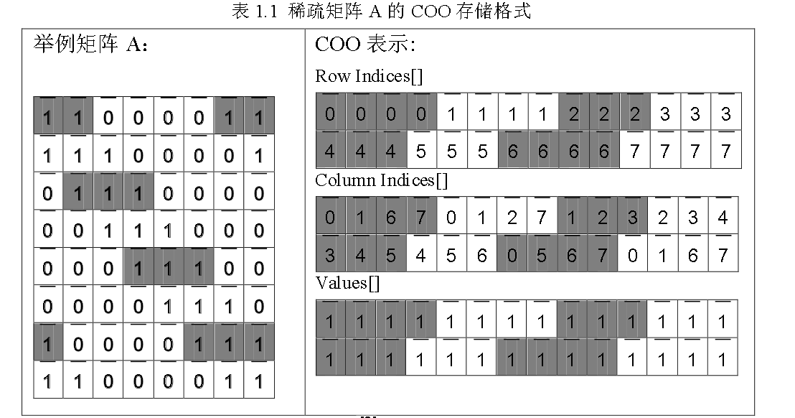
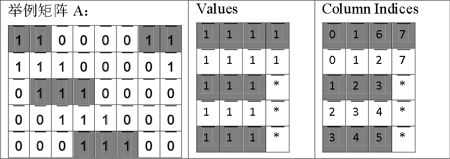
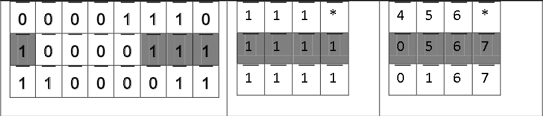

# 适合向量化的稀疏矩阵存储格式研究

本研究将以适合运用向量化技术并行加速的稀疏矩阵存储格式为研究对象，改进现有的存储格式，提出新的适合向量化的稀疏矩阵存储格式。

稀疏矩阵有大量的非零元

目前实际应用中广泛使用的稀疏矩阵存储格式有以下四种：

- Coordinate (COO) ：稀疏矩阵的每一个元素都可以用一个三元组来表示，即元素的数值以及该元素对应的行坐标和列坐标

- Compressed Sparse Row (CSR) ： CSR存储格式是<mark>在COO存储格式的基础上改进的行压缩的存储格式</mark>。从存储卡空间大小来说CSR存储格式优于COO格式

- ELLPACK(ELL) ： ELL存储格式用两个和原始矩阵相同行数的矩阵来存储稀疏矩阵。ELL格式引入了两个大小相同的二维数组，这两个二维数组的名称依次是column indices，values。
  
  - Diagnoal（DIA）：

